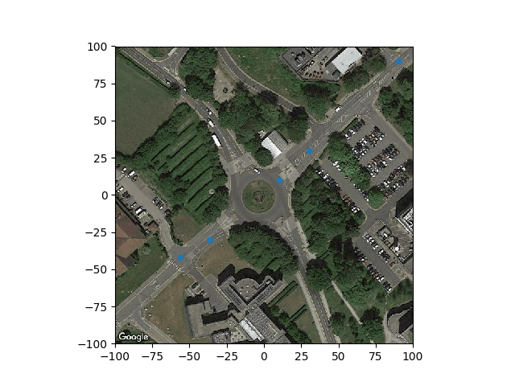

# gmapsplot
A simple script to download Google Maps satellite image and plot it using Matplotlib with ENU(East-North-Up) coordinates.

```python
import matplotlib.pyplot as plt
from gmapsplot import GMapsPlot

center = (52.382882, -1.565237) # this will be the x,y origin
gmaps = GMapsPlot(api_key="GOOGLE_MAP_KEY", center=center, zoom=18, scale=1, size_meter=(200, 200))
gmaps.download()
fig, ax = gmaps.plot()
ax.scatter([-56, -36, 10, 30, 95], [-42, -30, 10, 30, 95], s=20)
plt.show()
```


